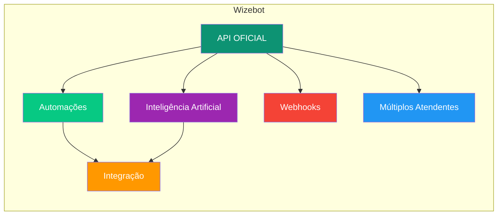

## O que é a Wizebot?

a Wizebot é uma plataforma completa para automação de WhatsApp Business, permitindo que empresas gerenciem suas comunicações de forma eficiente e escalável.

## Principais Recursos

<CardGroup cols={2}>
  <Card title="Automação de Mensagens" icon="robot">
    Crie fluxos automatizados de mensagens para atendimento 24/7
  </Card>
  <Card title="Gerenciamento de Contatos" icon="users">
    Organize e segmente seus contatos de forma eficiente
  </Card>
  <Card title="Templates Personalizados" icon="palette">
    Crie e gerencie templates de mensagem aprovados pelo WhatsApp
  </Card>
  <Card title="Integrações" icon="plug">
    Conecte com outras ferramentas através de webhooks e API
  </Card>
</CardGroup>

## Por Onde Começar

1. **Configuração Inicial**
   - Criar uma conta na Wizebot
   - Conectar número do WhatsApp Business
   - Configurar perfil empresarial

2. **Primeiros Passos**
   - Criar primeiro template de mensagem
   - Configurar respostas automáticas
   - Importar lista de contatos

3. **Recursos Avançados**
   - Configurar chatbots
   - Criar campanhas de broadcast
   - Integrar com outras plataformas

## Arquitetura da Plataforma

a Wizebot é uma plataforma robusta e escalável para automação de WhatsApp. Nossa arquitetura é dividida em componentes principais:

<CardGroup>
  <Card title="API OFICIAL" icon="code">
    Utilizamos a API oficial do WhatsApp
  </Card>
  
  <Card title="Automações" icon="robot">
    Motor de automação para suas conversas
  </Card>
  
  <Card title="Inteligência Artificial" icon="brain">
    Processamento inteligente de mensagens
  </Card>
  
  <Card title="Webhooks" icon="webhook">
    Integração com sistemas externos
  </Card>
  
  <Card title="Múltiplos Atendentes" icon="users">
    Gestão de equipe de atendimento
  </Card>
  
  <Card title="Integração" icon="puzzle">
    Conexão com outras plataformas
  </Card>
</CardGroup>

## Próximos Passos

<Steps>
  <Step title="Configuração">
    Aprenda a [configurar sua conta](/tutoriais/configuracao/conectar-whatsapp)
  </Step>
  <Step title="WhatsApp Cloud">
    Entenda a [API do WhatsApp Cloud](/tutoriais/visao-geral/whatsapp-cloud)
  </Step>
  <Step title="Templates">
    Crie seus primeiros [modelos de mensagem](/tutoriais/modelos-mensagem/criacao)
  </Step>
</Steps>
